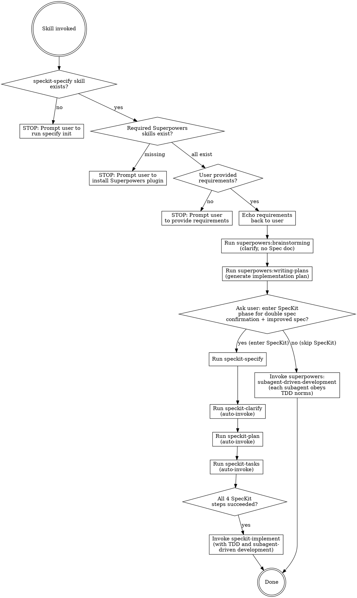

# Brainstorm, Specify, and Implement

Orchestrate a structured workflow: validate prerequisites → brainstorm → write implementation plan → ask user whether to enter SpecKit for double spec confirmation, or proceed directly to subagent-driven implementation.

## Decision Flow



## Prerequisites

This skill depends on two external plugins:

- **SpecKit** — provides `speckit-specify`, `speckit-clarify`, `speckit-plan`, `speckit-tasks`, `speckit-implement`
- **Superpowers** — provides `superpowers:brainstorming`, `superpowers:writing-plans`, `superpowers:test-driven-development`, and `superpowers:subagent-driven-development`

## Step-by-Step Workflow

Execute each step in order. Do NOT skip ahead. If any step fails its check, stop immediately and output the specified message to the user.

### Step 1 — Check SpecKit Initialization

Check whether the `speckit-specify` skill exists in the current session's available skills.

**If NOT found**, output the following message verbatim and stop:

```
该项目尚未使用 SpecKit 进行初始化。请在终端（Terminal）中执行以下命令后，重新启动 Claude Code 并调用此 Skill：
specify init --here --integration claude
```

**If found**, proceed to Step 2.

### Step 2 — Check Superpowers Skills

Verify that ALL FOUR of the following skills exist in the current session:

1. `superpowers:brainstorming`
2. `superpowers:writing-plans`
3. `superpowers:test-driven-development`
4. `superpowers:subagent-driven-development`

**If any is missing**, output:

```
该 Skill 依赖 Superpowers 插件中的 brainstorming、writing-plans、test-driven-development 和 subagent-driven-development 四个 Skill。请先安装 Superpowers 插件后重试。
```

**If all exist**, proceed to Step 3.

### Step 3 — Confirm User Requirements

Check whether the user provided requirements — either inline when invoking this skill, or in the preceding conversation context.

**If no requirements found**, output:

```
请描述您的需求（想要实现的功能或变更），然后重新调用此 Skill。
```

**If requirements are found**, echo them back to the user in a clear format:

```
确认需求如下：

[restate the user's requirements concisely here, in Chinese]

即将进入头脑风暴阶段，细化具体需求。
```

Then proceed to Step 4.

### Step 4 — Brainstorming

Invoke `superpowers:brainstorming` via the Skill tool to clarify and refine the user's requirements.

**Critical constraint:** Use brainstorming to explore intent, scope, edge cases, and design decisions. Do NOT generate a Superpowers Spec document. The output of this phase is a clear, shared understanding — not a written spec artifact.

After brainstorming concludes and requirements are clarified, proceed to Step 5.

### Step 5 — Write Implementation Plan

Invoke `superpowers:writing-plans` via the Skill tool to generate a structured implementation plan from the clarified requirements.

This step transforms the brainstorming output into a concrete, actionable plan before any spec or implementation work begins.

After the writing-plan concludes, proceed to Step 6.

### Step 6 — Ask User: SpecKit Double Confirmation

Present the user with a clear choice:

```
需求已明确，实现计划已生成。是否需要进入 SpecKit 阶段进行双重确认并生成改进版 Spec？

- **进入 SpecKit**：将自动依次执行 speckit-specify → speckit-clarify → speckit-plan → speckit-tasks → speckit-implement（使用 TDD 和 subagent-driven-development 实现）
- **跳过 SpecKit**：直接使用 superpowers:subagent-driven-development 进行实现（每个 subagent 遵循 TDD 规范）
```

Wait for the user's explicit choice, then proceed accordingly:

- **If user agrees to SpecKit** → proceed to Step 7a
- **If user declines SpecKit** → proceed to Step 7b

**Do NOT make this choice on behalf of the user.** This is a human-in-the-loop decision.

### Step 7a — SpecKit Pipeline (User Chose SpecKit)

Invoke the following 4 skills in strict sequence via the Skill tool. **This pipeline runs automatically end-to-end.** After each skill completes successfully, immediately proceed to the next — do NOT pause, ask "shall I continue?", or wait for user confirmation between steps.

1. `speckit-specify` — generates the spec document and creates the spec directory
2. `speckit-clarify` — clarifies ambiguities in the spec
3. `speckit-plan` — creates the implementation plan
4. `speckit-tasks` — breaks the plan into actionable tasks

**Auto-continuation:** Once `speckit-specify` starts, the pipeline proceeds through clarify → plan → tasks without interruption. The user should not need to type "speckit-clarify", "speckit-plan", or "speckit-tasks" manually — this skill orchestrates the full chain automatically.

**Human-in-the-Loop Constraint (CRITICAL):** If any SpecKit skill asks a substantive question — such as a design decision, preference between alternatives, clarification of ambiguous requirements, or any question that requires human judgment — you MUST surface that question to the user and wait for their answer. Do NOT make assumptions, guess, or choose on the user's behalf. The auto-continuation applies to the pipeline orchestration, NOT to answering domain-level questions for the user.

To distinguish:
- **Auto-continue through:** "Step complete. Moving to next phase..." (no user input needed)
- **Pause and ask user:** "Which authentication method should we use: OAuth2 or JWT?" (requires human judgment)
- **Pause and ask user:** "Should the API support batch operations or single-item only?" (design decision)

**Important:** After `speckit-specify` completes, note the generated spec directory path (typically `specs/001-xxx/`). You will need it for the implementation step.

If any of the 4 skills fails, report which skill failed and suggest the user re-run it individually.

After all 4 SpecKit steps complete, proceed to Step 8a.

### Step 8a — Implement via SpecKit (User Chose SpecKit)

After all 4 SpecKit steps complete successfully, immediately proceed to implementation. **Do NOT output a `/goal` prompt or wait for the user to initiate the next step.** Directly invoke the following skills in sequence:

1. Invoke `superpowers:test-driven-development` via the Skill tool to establish the TDD methodology.
2. Invoke `superpowers:subagent-driven-development` via the Skill tool to establish the parallel execution methodology.
3. Invoke `speckit-implement` via the Skill tool, pointing to the spec directory from Step 7a (e.g., `@specs/001-xxx/`). The `speckit-implement` skill will execute the tasks using TDD and subagent-driven development as the supporting methodology.

The spec directory path is the one generated by `speckit-specify` in Step 7a. Always use the actual directory name — never hardcode the path.

**Fallback:** If `speckit-implement` is not available (e.g., SpecKit version doesn't include it), output:

```
/goal 按照 @specs/001-xxx/ 的 Spec 规划，使用 Superpowers 的 TDD 和 subagent-driven-development 方式进行开发。验收标准为所有模块均通过 TDD 的测试。
```

Replace `specs/001-xxx/` with the actual spec directory path.

### Step 7b — Direct Implementation (User Skipped SpecKit)

Invoke the following skills in sequence:

1. Invoke `superpowers:test-driven-development` via the Skill tool to establish the TDD methodology.
2. Invoke `superpowers:subagent-driven-development` via the Skill tool to execute the implementation plan from Step 5.

**TDD Enforcement:** Each subagent dispatched during `subagent-driven-development` MUST obey `superpowers:test-driven-development` norms — write tests first, watch them fail, implement minimally, refactor, and verify 80%+ coverage.

## Common Mistakes

| Mistake | Correction |
|---------|------------|
| Skipping prerequisite checks | Always check Step 1 and Step 2 first — the workflow cannot proceed without SpecKit and Superpowers |
| Generating a Superpowers Spec doc in Step 4 | Brainstorming clarifies requirements verbally; the plan is generated by writing-plans in Step 5 |
| Skipping writing-plans and jumping to SpecKit | Step 5 must run after brainstorming — writing-plans transforms clarified requirements into a structured plan |
| Choosing SpecKit path on behalf of the user | Step 6 must present the choice explicitly; never assume the user wants SpecKit |
| Calling SpecKit skills in parallel | They must run sequentially: specify → clarify → plan → tasks |
| Pausing between SpecKit steps asking "shall I continue?" | Auto-continue through the pipeline; only pause when a skill asks a substantive question requiring human judgment |
| Answering SpecKit questions on behalf of the user | Surface all design decisions, preference trade-offs, and clarification questions to the user; never guess or assume |
| Using a hardcoded spec path in Step 8a | Always use the actual directory path from `speckit-specify` output |
| Outputting a `/goal` prompt instead of directly invoking implementation | Step 8a must directly invoke `speckit-implement`; only fall back to the `/goal` prompt if the skill is unavailable |
| Proceeding after a skill fails | Stop and report which skill failed; do not continue the pipeline |
| Forgetting to invoke TDD before subagent-development in Step 7b | Always invoke `superpowers:test-driven-development` before `superpowers:subagent-driven-development` |
| Subagents in Step 7b skipping TDD | Each subagent in the direct implementation path must follow TDD norms — enforce this explicitly |
