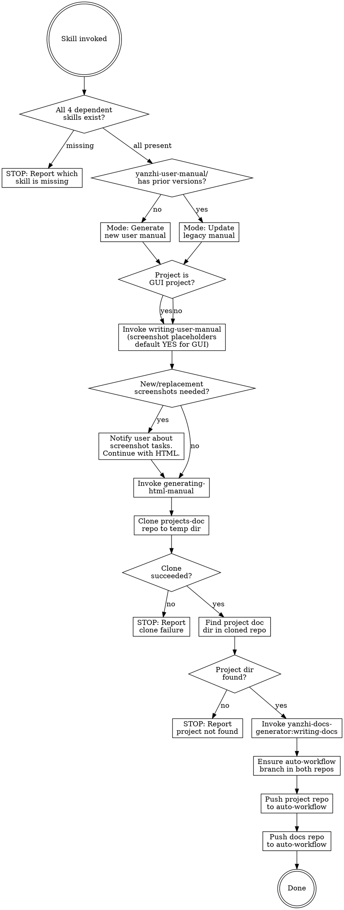

# Manual and Docs Git Sync

After a brainstorming-specify-tdd workflow completes, automatically update the user manual, convert it to HTML, refresh architecture documentation, and push both repos.

## Decision Flow



## Prerequisites

This skill depends on four external plugin skills:

- **yanzhi-user-manual-generator** — provides `writing-user-manual` and `generating-html-manual`
- **yanzhi-docs-generator** — provides `writing-docs`
- **project-version-workflow** — provides `update-commit-bypass`

## Step-by-Step Workflow

Execute each step in order. If any prerequisite check fails, stop immediately and report the missing skill.

### Step 0 — Validate Dependencies

Check that ALL of the following skills exist in the current session:

1. `yanzhi-user-manual-generator:writing-user-manual`
2. `yanzhi-user-manual-generator:generating-html-manual`
3. `yanzhi-docs-generator:writing-docs`
4. `project-version-workflow:update-commit-bypass`

**If any is missing**, output the missing skill name(s) and stop.

---

### USER MANUAL WORKFLOW

### Step 1 — Determine Manual Mode (Generate vs Update)

Check whether the `yanzhi-user-manual/` directory in the project root contains prior version directories (subdirectories matching the `vYYMMDD-N` pattern).

**If no prior versions exist** → Generate mode: the writing-user-manual skill will create a new manual from the current project source/spec. The new manual version directory will be named `vYYMMDD-N` where `YYMMDD` is today's date and `N` starts at `0` (if `N`=`0`, the version is only named vYYMMDD, hiding `-N`).

**If prior versions exist** → Update mode: find the latest version (highest `N` for today, or the most recent date), which serves as the legacy manual input. Copy all screenshots from the legacy manual's `screenshots/` directory to preserve them for reference.

### Step 2 — Invoke writing-user-manual

**Before invoking**, determine whether the project is a GUI project. A project is considered GUI if it contains any of the following:

- Web frontend (HTML, React, Vue, Angular, Next.js, etc.)
- Desktop GUI (Electron, Qt, SwiftUI, WinForms, WPF, etc.)
- Mobile app (iOS, Android, Flutter, React Native, etc.)
- CLI/TUI with interactive interfaces
- Any visual interface that end users interact with

**Detection:** Scan the project's source code for UI frameworks, check `package.json` dependencies, or examine the project structure for frontend directories (e.g., `src/`, `app/`, `components/`, `pages/`, `views/`).

**When invoking writing-user-manual**, include the screenshot decision in the invocation context:

- **GUI project** → Invoke with the instruction: "This is a GUI project. Default to using screenshot placeholders — do not ask the user whether to include them. Proceed directly to generating the manual with screenshot placeholders."
- **Non-GUI project** → Invoke normally; the writing-user-manual skill will detect no visual interface and skip the screenshot question automatically.

This ensures the writing-user-manual skill does not interrupt the automated workflow with `AskUserQuestion` prompts about screenshot placeholders.

Invoke `yanzhi-user-manual-generator:writing-user-manual` via the Skill tool.

- **In generate mode**: The skill receives no legacy manual; it will create one from source/spec.
- **In update mode**: Point the skill to the latest legacy manual as input, along with the current project source/spec.

**IMPORTANT:** After the writing-user-manual skill completes, carefully read its terminal output (the screenshot modification table for update mode, or the screenshot placeholder table for generate mode) to determine whether new or replacement screenshots are needed.

Specify the output path as `yanzhi-user-manual/vYYMMDD-N/` (replace with the actual computed version string).

### Step 3 — Check for Screenshot Status

After writing-user-manual completes, check its output:

- If the skill reported **any new screenshot placeholders** (generate mode) or **any "新增" or "替换" entries** in the screenshot modification table (update mode), new screenshots need to be created.
- If only "保留" (keep) entries exist in update mode, no new screenshots are needed.

**If new screenshots are needed:**

1. Notify the user clearly with a message:
   ```
   用户手册已生成/更新，但存在需要新增或替换的截图。以下截图占位符已保留在文档中，请手动替换图片文件：
   [list the affected screenshots with their target file paths]

   Markdown 和 HTML 均已生成。已有截图已由 generating-html-manual 自动处理，缺失截图在 HTML 中以占位符显示。
   请分别向 Markdown 的截图目录和 HTML 输出目录中放入对应的图片文件，刷新 HTML 即可看到完整效果。
   ```
2. **Continue** to Step 4 to generate HTML. The HTML and Markdown MUST still be generated regardless of missing screenshots. The `generating-html-manual` skill handles existing screenshots and placeholder rendering per its own conventions — consult that skill's output for the exact directory structure where image files should be placed.
3. **Continue** with the architecture docs workflow (Step 5).

**If no new screenshots are needed**, proceed to Step 4 directly.

### Step 4 — Convert to HTML

**Always execute this step**, regardless of whether new screenshots are needed.

Invoke `yanzhi-user-manual-generator:generating-html-manual` via the Skill tool, pointing to the newly created/updated markdown manual at `yanzhi-user-manual/vYYMMDD-N/<manual-filename>.md`.

The HTML output will be written to `yanzhi-user-manual/vYYMMDD-N/html/` by the generating-html-manual skill.

**Image references:** The `generating-html-manual` skill handles image path conversion and screenshot placement according to its own conventions. This skill does not prescribe the exact directory structure (e.g., subfolder names) — those are defined by `generating-html-manual` and may evolve independently. After HTML generation completes, verify that image references in both Markdown and HTML are consistent with the actual output structure.

---

### ARCHITECTURE DOCS WORKFLOW

### Step 5 — Clone the Documentation Repository

Clone the company documentation repository to a temporary directory:

```bash
tmpdir=$(mktemp -d)
git clone http://192.168.1.237:8080/doc/projects-doc "$tmpdir/projects-doc"
```

**If the clone fails**, output the error message and stop. Do not proceed.

### Step 6 — Find the Project Documentation Directory

In the cloned repository (`$tmpdir/projects-doc`), locate the subdirectory that corresponds to the **current project**. Match by:

1. The project's directory name (e.g., `basename $(pwd)`)
2. A README or index file listing project names to directory mappings

**If no matching directory is found**, output:
```
在文档仓库中未找到与本项目对应的文档目录。请确认文档仓库中是否已创建本项目的文档目录。
```
Then stop. Do not proceed.

**If found**, note the full path to the project's docs directory. This will be passed as the target to the writing-docs skill.

### Step 7 — Invoke writing-docs

Invoke `yanzhi-docs-generator:writing-docs` via the Skill tool. This skill will detect whether existing docs exist and perform either a full generation or delta update (based on git diff of the last 3 commits).

The writing-docs skill will update the project's doc files in-place within the cloned docs repo.

---

### COMMIT AND PUSH

### Step 8 — Ensure auto-workflow Branch

Both the **project repository** and the **cloned docs repository** must be on (or create) the `auto-workflow` branch before committing and pushing.

For EACH repository:

```bash
# Check if branch exists locally
git branch --list auto-workflow

# If not, check remote and create tracking branch
git fetch origin auto-workflow 2>/dev/null

# Create or switch to auto-workflow
if git show-ref --verify --quiet refs/heads/auto-workflow; then
  git checkout auto-workflow
else
  git checkout -b auto-workflow
fi
```

### Step 9 — Push Both Repositories

**Project repository** (the current working directory):

Invoke `project-version-workflow:update-commit-bypass` via the Skill tool. The skill auto-commits with a conventional commit message, creates a version tag, and pushes to the `auto-workflow` branch.

**Docs repository** (the cloned temp directory):

Do NOT use `update-commit-bypass` for the docs repo. Instead, manually commit and push with a commit message that **explicitly identifies which project's documentation was updated**.

First, capture the project name and doc directory path (same name used to match the docs directory in Step 6):

```bash
PROJECT_NAME=$(basename $(pwd))
PROJECT_DOC_DIR="<project-doc-dir>"  # e.g., "智慧教研系统-yz-smart-research"
```

Then execute the following sequence in the docs repo. **This sequence is MANDATORY — do not skip or reorder any step:**

```bash
cd "$tmpdir/projects-doc"

# Step 9a — Pull latest changes from remote FIRST
git pull origin auto-workflow

# Step 9b — If git pull reports conflicts, resolve them immediately
# Resolution principle: MAXIMALLY PRESERVE ALL CONTENT from both sides.
# - For each conflicted file, keep ALL unique content from BOTH remote and local versions
# - Do NOT delete or discard any content from either side
# - If the same section was modified differently, keep both versions with clear markers
#   indicating which is remote and which is local
# - After resolving, mark conflicts as resolved:
#   git add <resolved-files>

# Step 9c — Stage all changes in the project's doc directory
git add "$PROJECT_DOC_DIR"/

# Step 9d — Commit with project-identifying message
# The commit message MUST specify which document directory was changed
git commit -m "docs: update $PROJECT_NAME/$PROJECT_DOC_DIR documentation"

# Step 9e — Push to auto-workflow
git push origin auto-workflow
```

The commit message format is: `docs: update <project-name>/<doc-directory> documentation`

This ensures anyone browsing the `projects-doc` commit history can immediately see which project and which doc directory was updated.

**⚠️ CRITICAL: NEVER use `git push --force` (or `git push -f` or `git push --force-with-lease`).**

If `git push` fails (e.g., rejected because remote has newer commits):
1. Run `git pull origin auto-workflow` again to fetch the latest remote changes
2. Resolve any conflicts (maximally preserve all content from both sides)
3. Re-run `git commit` if needed (or amend if conflicts were resolved in the merge commit)
4. Run `git push origin auto-workflow` again
5. Repeat this loop until push succeeds — **never bypass with force push**

**Why not use `update-commit-bypass` for the docs repo?** The `update-commit-bypass` skill auto-generates commit messages from the diff content. Since `projects-doc` is a shared repository containing documentation for multiple projects, a generic auto-generated message like "update architecture docs" would not indicate which project changed. A manual commit with an explicit project identifier is required.

### Step 10 — Cleanup

Remove the temporary clone directory:

```bash
rm -rf "$tmpdir"
```

Output a final summary:

```
同步完成：
- 用户手册：yanzhi-user-manual/vYYMMDD-N/ [含 Markdown 和 HTML 版本]
- 截图状态：[无需截图] 或 [需手动补充截图：将图片分别放入 Markdown 和 HTML 的截图目录后刷新即可]
- 架构文档：[docs repo path] 已更新
- 项目仓库：已推送至 auto-workflow 分支
- 文档仓库：已推送至 auto-workflow 分支
```

## Common Mistakes

| Mistake | Correction |
|---------|------------|
| Skipping dependency check | Always validate all 4 skills exist before starting |
| Forgetting to copy old screenshots in update mode | Copy the legacy `screenshots/` directory to the new version before invoking writing-user-manual |
| Not detecting GUI project before invoking writing-user-manual | Scan project for UI frameworks (web, desktop, mobile, CLI/TUI); if GUI, pass "default screenshot placeholders YES" instruction to avoid AskUserQuestion interruption |
| Proceeding with HTML when screenshots are missing | Always generate both Markdown and HTML regardless; image reference paths must be correct so user only needs to drop files in |
| Not computing the correct version directory name | Use today's date as YYMMDD, increment N from 1 based on existing dirs for the same date |
| Cloning docs repo into project directory | Always clone to a temp directory (`mktemp -d`), never inside the project |
| Not matching the project name correctly | Match by project directory basename or explicit mapping in the docs repo |
| Pushing only one repository | Both the project repo AND the docs repo must be pushed |
| Pushing to wrong branch | Both repos must push to `auto-workflow`, NOT `main` |
| Leaving temp clone on disk | Always `rm -rf` the temp directory after pushing |
| Missing or incorrect image reference paths | After HTML generation, verify both Markdown and HTML image references are consistent with the actual output directory structure; generating-html-manual handles path conversion per its own conventions |
| Using different version names for manual and HTML | Both must use the same `vYYMMDD-N/` directory — HTML output goes inside it as `html/` |
| Using `git push --force` for docs repo | **NEVER** use `--force`, `-f`, or `--force-with-lease`. If push fails, `git pull` → resolve conflicts → re-commit → push again. Repeat until successful. |
| Pushing docs repo without `git pull` first | Always `git pull origin auto-workflow` BEFORE committing and pushing. This prevents unnecessary conflicts and ensures the docs repo is up to date. |
| Discarding content during conflict resolution | When resolving conflicts in `projects-doc`, maximally preserve ALL content from BOTH sides. Never delete or discard content — keep everything from both remote and local versions. |
| Not specifying which doc directory changed in commit message | The commit message must identify the project AND the specific doc directory: `docs: update <project>/<doc-dir> documentation` |
