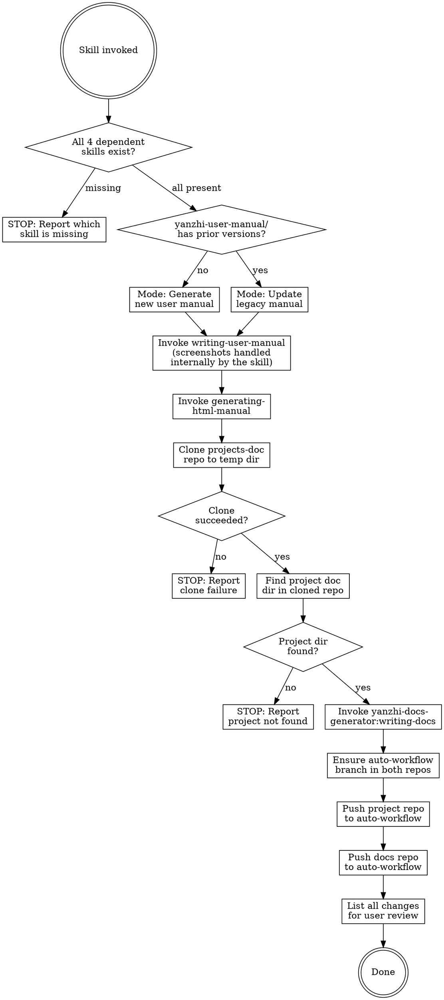

# Manual and Docs Git Sync

After a brainstorming-specify-tdd workflow completes, automatically update the user manual, convert it to HTML, refresh architecture documentation, and push both repos. Screenshot capture (including auto-capture for web apps) is handled internally by the `writing-user-manual` skill.

## Decision Flow



## Prerequisites

This skill depends on four external plugin skills:

- **yanzhi-user-manual-generator** — provides `writing-user-manual` and `generating-html-manual`
- **yanzhi-docs-generator** — provides `writing-docs`
- **project-version-workflow** — provides `update-commit-bypass`

## Step-by-Step Workflow

Execute each step in order. If any prerequisite check fails, stop immediately and report the missing skill.

### Step 0 — Validate Dependencies

Check that ALL of the following skills exist in the current session:

1. `yanzhi-user-manual-generator:writing-user-manual`
2. `yanzhi-user-manual-generator:generating-html-manual`
3. `yanzhi-docs-generator:writing-docs`
4. `project-version-workflow:update-commit-bypass`

**If any of the 4 required skills is missing**, output the missing skill name(s) and stop.

---

### USER MANUAL WORKFLOW

### Step 1 — Extract Version Name and Determine Manual Mode

#### 1a — Extract Version Name from Project Source

Extract the project's version name from the source code using the method described in `yanzhi-user-manual-generator:writing-user-manual` Step 1 ("Extract and Validate Version Name"). The writing-user-manual skill searches common locations (config files, source code, spec documents, git tags, changelogs) to find the version name.

**If the version name cannot be found**, stop and warn the user — the version name is required for the manual directory name.

Record the extracted version name as `<version-name>` (e.g., `v123`).

#### 1b — Determine Manual Mode (Generate vs Update)

Check whether the `yanzhi-user-manual/` directory in the project root contains any prior version subdirectories.

**If no prior versions exist** → Generate mode: the writing-user-manual skill will create a new manual from the current project source/spec.

**If prior versions exist** → Update mode: find the latest version directory (by sorting directory names alphabetically or by embedded timestamp), which serves as the legacy manual input.

The new manual version directory will be named:

```
<version-name>-YYMMDD-HHmmss
```

Where `<version-name>` is from Step 1a (e.g., `v123`), `YYMMDD` is today's date, and `HHmmss` is the current time.

Example: `v123-260601-150233`

### Step 2 — Invoke writing-user-manual

Invoke `yanzhi-user-manual-generator:writing-user-manual` via the Skill tool. The writing-user-manual skill handles GUI detection, screenshot placeholders, and auto-capture internally.

- **In generate mode**: The skill receives no legacy manual; it will create one from source/spec.
- **In update mode**: Point the skill to the latest legacy manual as input, along with the current project source/spec.

Specify the output path as `yanzhi-user-manual/<version-name>-YYMMDD-HHmmss/` (replace with the actual computed version string).

> The `yanzhi-user-manual-generator:writing-user-manual` skill will invoke auto capture skill to take screenshots.

### Step 3 — Convert to HTML

Invoke `yanzhi-user-manual-generator:generating-html-manual` via the Skill tool, pointing to the newly created/updated markdown manual at `yanzhi-user-manual/<version-name>-YYMMDD-HHmmss/<manual-filename>.md`.

The HTML output will be written to `yanzhi-user-manual/<version-name>-YYMMDD-HHmmss/html/` by the generating-html-manual skill. Screenshot handling, image path conversion, and placeholder processing are managed internally by `generating-html-manual`.

---

### ARCHITECTURE DOCS WORKFLOW

### Step 4 — Clone the Documentation Repository

Clone the company documentation repository to a local temp directory. **Always clone fresh from the `main` branch** — never reuse a previous clone. The directory name includes a timestamp for traceability:

```bash
TMPDIR="${TMPDIR:-/tmp}"
TIMESTAMP=$(date +%y%m%d%H%M%S)
DOCS_CLONE_DIR="$TMPDIR/projects-doc-$TIMESTAMP"

# Always clone fresh from main branch — do NOT reuse previous clones
git clone -b main http://192.168.1.237:8080/doc/projects-doc "$DOCS_CLONE_DIR"
```

**If the clone fails**, output the error message and stop. Do not proceed.

### Step 5 — Find the Project Documentation Directory

In the cloned repository (`$DOCS_CLONE_DIR`), locate the subdirectory that corresponds to the **current project**. Match by:

1. The project's directory name (e.g., `basename $(pwd)`)
2. A README or index file listing project names to directory mappings

**If no matching directory is found**, output:
```
在文档仓库中未找到与本项目对应的文档目录。请确认文档仓库中是否已创建本项目的文档目录。
```
Then stop. Do not proceed.

**If found**, note the full path to the project's docs directory. This will be passed as the target to the writing-docs skill.

### Step 6 — Invoke writing-docs

Invoke `yanzhi-docs-generator:writing-docs` via the Skill tool. This skill will detect whether existing docs exist and perform either a full generation or delta update (based on git diff of the last 3 commits). The writing-docs skill handles GUI detection, screenshot placeholders, and auto-capture internally.

The writing-docs skill will update the project's doc files in-place within the cloned docs repo.

> The ``yanzhi-docs-generator:writing-docs`` skill will invoke auto capture skill to take screenshots.

---

### COMMIT AND PUSH

### Step 7 — Ensure auto-workflow Branch

Both the **project repository** and the **cloned docs repository** must be on (or create) the `auto-workflow` branch before committing and pushing.

For EACH repository:

```bash
# Check if branch exists locally
git branch --list auto-workflow

# If not, check remote and create tracking branch
git fetch origin auto-workflow 2>/dev/null

# Create or switch to auto-workflow
if git show-ref --verify --quiet refs/heads/auto-workflow; then
  git checkout auto-workflow
else
  git checkout -b auto-workflow
fi
```

### Step 8 — Push Both Repositories

**Project repository** (the current working directory):

Invoke `project-version-workflow:update-commit-bypass` via the Skill tool. The skill auto-commits with a conventional commit message, creates a version tag, and pushes to the `auto-workflow` branch.

**Docs repository** (the cloned docs directory at `$DOCS_CLONE_DIR`):

Do NOT use `update-commit-bypass` for the docs repo. Instead, manually commit and push with a commit message that **explicitly identifies which project's documentation was updated**.

First, capture the project name and doc directory path (same name used to match the docs directory in Step 5):

```bash
PROJECT_NAME=$(basename $(pwd))
PROJECT_DOC_DIR="<project-doc-dir>"  # e.g., "智慧教研系统-yz-smart-research"
```

Then execute the following sequence in the docs repo. **This sequence is MANDATORY — do not skip or reorder any step:**

```bash
cd "$DOCS_CLONE_DIR"

# Step 8a — Pull latest changes from remote FIRST
git pull origin auto-workflow

# Step 8b — If git pull reports conflicts, resolve them immediately
# Resolution principle: MAXIMALLY PRESERVE ALL CONTENT from both sides.
# - For each conflicted file, keep ALL unique content from BOTH remote and local versions
# - Do NOT delete or discard any content from either side
# - If the same section was modified differently, keep both versions with clear markers
#   indicating which is remote and which is local
# - After resolving, mark conflicts as resolved:
#   git add <resolved-files>

# Step 8c — Stage all changes in the project's doc directory
git add "$PROJECT_DOC_DIR"/

# Step 8d — Commit with project-identifying message
# The commit message MUST specify which document directory was changed
git commit -m "docs: update $PROJECT_NAME/$PROJECT_DOC_DIR documentation"

# Step 8e — Push to auto-workflow
git push origin auto-workflow
```

The commit message format is: `docs: update <project-name>/<doc-directory> documentation`

This ensures anyone browsing the `projects-doc` commit history can immediately see which project and which doc directory was updated.

**⚠️ CRITICAL: NEVER use `git push --force` (or `git push -f` or `git push --force-with-lease`).**

If `git push` fails (e.g., rejected because remote has newer commits):
1. Run `git pull origin auto-workflow` again to fetch the latest remote changes
2. Resolve any conflicts (maximally preserve all content from both sides)
3. Re-run `git commit` if needed (or amend if conflicts were resolved in the merge commit)
4. Run `git push origin auto-workflow` again
5. Repeat this loop until push succeeds — **never bypass with force push**

**Why not use `update-commit-bypass` for the docs repo?** The `update-commit-bypass` skill auto-generates commit messages from the diff content. Since `projects-doc` is a shared repository containing documentation for multiple projects, a generic auto-generated message like "update architecture docs" would not indicate which project changed. A manual commit with an explicit project identifier is required.

### Step 9 — Keep Temp Directory

**Do NOT delete the cloned `projects-doc` directory.** The clone at `$DOCS_CLONE_DIR` is kept on disk for future reference. Each sync run creates a fresh clone with a timestamped directory name (`projects-doc-YYMMDDHHmmss`), so there is no risk of stale data from previous runs.

---

### REVIEW AND FINAL SUMMARY

### Step 10 — List All Changes for User Review

**Before outputting the final summary**, present a comprehensive change review so the user can audit the architecture document changes.

#### 10a — Architecture Document Change Review

Show the file changes that were committed to the docs repo. Run the following in the docs clone:

```bash
cd "$DOCS_CLONE_DIR"
git show --stat HEAD
```

Present the output as:

```
📄 架构文档变更（projects-doc commit: <commit-hash-short>）：
[git show --stat output showing changed files with +/- line counts]

文档目录：$PROJECT_DOC_DIR/
变更文件：
  - <file1> (+XX -YY lines)
  - <file2> (+XX -YY lines)
  ...
```

**If no files were changed** (e.g., writing-docs detected no updates needed), output:
```
📄 架构文档：无变更（writing-docs 未检测到需要更新的内容）
```

#### 10b — Output Final Summary

After the change review, output the final summary:

```
同步完成：
- 用户手册：yanzhi-user-manual/<version-name>-YYMMDD-HHmmss/ [含 Markdown 和 HTML 版本]
- 架构文档：[docs repo path] 已更新（详见上方文档变更）
- 项目仓库：已推送至 auto-workflow 分支
- 文档仓库：已推送至 auto-workflow 分支
- 文档本地副本：$DOCS_CLONE_DIR（已保留，未删除）
```

#### 10c — Screenshot Summary

List all screenshots captured during the workflow, organized by category. Show the file path and status for each screenshot.

Include:

- Architecture Document Screenshots

- User Manual Screenshots

> Screenshot capture is handled internally by `writing-user-manual` and `writing-docs` skills. This step only reports what was captured — it does NOT trigger new screenshots.

## Common Mistakes

| Mistake | Correction |
|---------|------------|
| Skipping dependency check | Always validate all 4 required skills exist before starting |
| Not computing the correct version directory name | Extract version-name from project source using writing-user-manual's method (Step 1a), then combine with YYMMDD-HHmmss timestamp |
| Cloning docs repo into project directory | Always clone to the temp directory with timestamp (`$TMPDIR/projects-doc-YYMMDDHHmmss`), never inside the project |
| Not matching the project name correctly | Match by project directory basename or explicit mapping in the docs repo |
| Pushing only one repository | Both the project repo AND the docs repo must be pushed |
| Pushing to wrong branch | Both repos must push to `auto-workflow`, NOT `main` |
| Reusing a previous docs clone | Always clone fresh. The `git clone` command in Step 4 creates a new timestamped directory (`projects-doc-YYMMDDHHmmss`) — never use `projects-doc-clone` or any existing directory |
| Deleting the cloned docs directory | Keep the cloned `projects-doc-YYMMDDHHmmss` directory on disk for future reference — do NOT `rm -rf` it |
| Using different version names for manual and HTML | Both must use the same `<version-name>-YYMMDD-HHmmss/` directory — HTML output goes inside it as `html/` |
| Using `git push --force` for docs repo | **NEVER** use `--force`, `-f`, or `--force-with-lease`. If push fails, `git pull` → resolve conflicts → re-commit → push again. Repeat until successful. |
| Pushing docs repo without `git pull` first | Always `git pull origin auto-workflow` BEFORE committing and pushing. This prevents unnecessary conflicts and ensures the docs repo is up to date. |
| Discarding content during conflict resolution | When resolving conflicts in `projects-doc`, maximally preserve ALL content from BOTH sides. Never delete or discard content — keep everything from both remote and local versions. |
| Not specifying which doc directory changed in commit message | The commit message must identify the project AND the specific doc directory: `docs: update <project>/<doc-dir> documentation` |
| Skipping user review of changes at end | Always present Step 10 change review (docs git diff) before final summary. This lets the user audit all changes before the workflow concludes |
