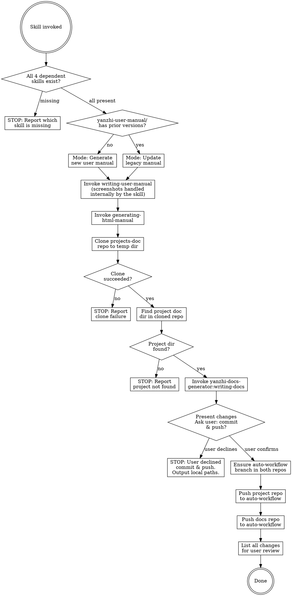

# Manual and Docs Git Sync

After a brainstorming-specify-tdd workflow completes, automatically update the user manual, convert it to HTML, refresh architecture documentation, and push both repos.

## Foundational Principle

**Violating the letter of these rules is violating the spirit of these rules.**

This workflow exists because each step prevents a known failure mode. Skipping any step — even one that seems unnecessary right now — has caused data loss, broken docs, or pushed to the wrong branch. The steps are not optional. They are not "nice-to-have." They are the minimum safe path.

If you find yourself thinking "this step doesn't apply here" or "the user said I could skip this," you are rationalizing. See the table below.

## Rationalization Table — Why You're About to Make a Mistake

| Your Thought | Reality |
|---|---|
| "The user says deps are installed, I can skip checking" | Skills can be missing despite user belief. Check takes 5 seconds. A missing skill discovered at Step 2 wastes minutes. |
| "I'll reuse the clone from last time" | The old clone may be on the wrong branch, have uncommitted changes, or be stale. Always clone fresh. |
| "Nobody else works on this branch, skip git pull" | CI/CD, automated processes, or other sessions can push. Pull first, every time. |
| "I'll just git add -A, it's faster" | `git add -A` stages unrelated files from other projects in a shared docs repo. Target the specific project directory only. |
| "Push failed — I'll use --force to get it through" | Force push overwrites others' work silently. Pull, resolve, re-push. Never force. |
| "I'll delete the temp clone, it's messy" | The clone is timestamped evidence of what was pushed. Keep it for traceability. |
| "The user was here for the session, they know what changed" | Memory is fallible. The change review is the authoritative record. Always present it. |
| "The user said they don't need the screenshot summary" | The summary is required output — it documents what was captured vs placeholder. Skip it and you lose visibility into missing assets. |
| "We're almost done, let's just push and finish" | Rushing the final steps is when the worst mistakes happen. The last 10% of steps prevent 90% of incidents. |
| "I'll write a quick commit message, the diff speaks for itself" | In a shared docs repo, commit messages must identify which project changed. Generic messages make `git log` useless for other teams. |
| "I'll just do the manual part, the docs can wait" | Partial execution is still a violation. The workflow is atomic — all 12 steps or stop at the first failure. Half-synced state is worse than no sync. |
| "The user asked to sync, so they want me to push" | Syncing = generating docs. Committing/pushing is a separate action. The user may want to review before pushing. Always confirm. |
| "I'll commit and push, the user can revert if they don't like it" | Reverting pushed commits is messy and public. Get confirmation BEFORE pushing, not forgiveness after. |
| "The user isn't responding, I'll push and let them know" | Never assume consent from silence. Wait for explicit confirmation. |

## Red Flags — STOP and Re-Read the Rules

If any of these thoughts cross your mind, you are about to skip a mandatory step:

- "This step is just a formality"
- "The user said I could skip this"
- "I know this environment, this check is unnecessary"
- "We're in a hurry, I'll do the minimum"
- "I already verified this implicitly"
- "It's faster to..."
- "I'll just this once..."
- "I'll do the manual now, docs later"
- "Half the workflow is better than nothing"
- "The user said sync, so they must want me to push"
- "I'll push first and ask later"
- "They'll see the push notification anyway"

**All of these mean: Go back. Read the step. Execute it exactly as written.**

## Prerequisites

This skill depends on four external plugin skills:

- **yanzhi-user-manual-generator** — provides `writing-user-manual` and `generating-html-manual`
- **yanzhi-docs-generator** — provides `writing-docs`
- **project-version-workflow** — provides `update-commit-bypass`

## Decision Flow



## Step-by-Step Workflow

Execute each step in order. If any prerequisite check fails, stop immediately and report the missing skill. **No step is skippable** — not even if the user says so, not even if you're in a hurry, not even if "you know the environment." **No partial execution** — completing only the user manual workflow (Steps 1-3) without the docs workflow (Steps 4-12) is a violation. All 12 steps must execute, in order, every time.

## Sub-Skill Blocking Rule

When `writing-user-manual` or `writing-docs` encounters a situation where it **cannot proceed** (e.g., cannot find commit history, source code is broken or incomplete, version name mismatch, ambiguous inputs the skill cannot resolve on its own), **pause immediately** and present the issue to the user for confirmation. Do NOT guess, work around, or auto-resolve these blockers.

**Screenshot placeholder exemption:** The `writing-user-manual` skill may insert screenshot placeholders by default without user confirmation. Screenshot-related decisions are NOT blockers — allow them automatically. Only pause when the sub-skill signals it cannot complete its core generation/update task.

### Step 0 — Validate Dependencies

Check that ALL of the following skills exist in the current session:

1. `yanzhi-user-manual-generator:writing-user-manual`
2. `yanzhi-user-manual-generator:generating-html-manual`
3. `yanzhi-docs-generator:writing-docs`
4. `project-version-workflow:update-commit-bypass`

**If any of the 4 required skills is missing**, output the missing skill name(s) and stop.

**This step is MANDATORY. No exceptions:**
- Do NOT skip because "the user says deps are installed" — the user may be mistaken, and discovering a missing skill at Step 2 is more disruptive than the 5-second check now
- Do NOT skip because "they were here last session" — plugin configurations change between sessions
- Do NOT "check implicitly by invoking" — explicitly validate before any work begins
- Do NOT trust that "there's no downside risk" — the downside is wasted work when a skill fails mid-workflow

---

### USER MANUAL WORKFLOW

### Step 1 — Extract Version Name and Determine Manual Mode

#### 1a — Extract Version Name from Project Source

Extract the project's version name from the source code using the method described in `yanzhi-user-manual-generator:writing-user-manual` Step 1 ("Extract and Validate Version Name"). The writing-user-manual skill searches common locations (config files, source code, spec documents, git tags, changelogs) to find the version name.

**If the version name cannot be found**, stop and warn the user — the version name is required for the manual directory name.

Record the extracted version name as `<version-name>` (e.g., `v123`).

#### 1b — Determine Manual Mode (Generate vs Update)

Check whether the `yanzhi-user-manual/` directory in the project root contains any prior version subdirectories.

**If no prior versions exist** → Generate mode: the writing-user-manual skill will create a new manual from the current project source/spec.

**If prior versions exist** → Update mode: find the latest version directory (by sorting directory names alphabetically or by embedded timestamp), which serves as the legacy manual input.

The new manual version directory will be named:

```
<version-name>-YYMMDD-HHmmss
```

Where `<version-name>` is from Step 1a (e.g., `v123`), `YYMMDD` is today's date, and `HHmmss` is the current time.

Example: `v123-260601-150233`

### Step 2 — Invoke writing-user-manual

Invoke `yanzhi-user-manual-generator:writing-user-manual` via the Skill tool. The writing-user-manual skill handles GUI detection, screenshot placeholders, and auto-capture internally.

- **In generate mode**: The skill receives no legacy manual; it will create one from source/spec.
- **In update mode**: Point the skill to the latest legacy manual as input, along with the current project source/spec.

Specify the output path as `yanzhi-user-manual/<version-name>-YYMMDD-HHmmss/` (replace with the actual computed version string).

> The `yanzhi-user-manual-generator:writing-user-manual` skill will invoke auto capture skill to take screenshots.

**If `writing-user-manual` cannot proceed** (e.g., cannot find commit history, source code issues, version mismatch), pause and ask the user for confirmation. Screenshot placeholder insertion is exempt — allow by default without asking.

### Step 3 — Convert to HTML

Invoke `yanzhi-user-manual-generator:generating-html-manual` via the Skill tool, pointing to the newly created/updated markdown manual at `yanzhi-user-manual/<version-name>-YYMMDD-HHmmss/<manual-filename>.md`.

The HTML output will be written to `yanzhi-user-manual/<version-name>-YYMMDD-HHmmss/html/` by the generating-html-manual skill. Screenshot handling, image path conversion, and placeholder processing are managed internally by `generating-html-manual`.

---

### Step 4 — Clone the Documentation Repository

Clone the company documentation repository to a local temp directory. **Always clone fresh from the `main` branch** — never reuse a previous clone. The directory name includes a timestamp for traceability:

```bash
TMPDIR="${TMPDIR:-/tmp}"
TIMESTAMP=$(date +%y%m%d%H%M%S)
DOCS_CLONE_DIR="$TMPDIR/projects-doc-$TIMESTAMP"

# Always clone fresh from main branch — do NOT reuse previous clones
git clone -b main http://192.168.1.237:8080/doc/projects-doc "$DOCS_CLONE_DIR"
```

**If the clone fails**, output the error message and stop. Do not proceed.

**This step is MANDATORY. No exceptions:**
- Do NOT check if a previous clone exists and reuse it — the old clone may be on the wrong branch, have uncommitted changes, be stale, or contain conflicts from a previous run
- Do NOT "just pull" an existing clone instead of cloning fresh — a fresh clone guarantees clean state
- Do NOT skip the timestamp in the directory name — it ensures each run is traceable
- Do NOT clone into the project directory — always use `$TMPDIR`

### Step 5 — Find the Project Documentation Directory

In the cloned repository (`$DOCS_CLONE_DIR`), locate the subdirectory that corresponds to the **current project**. Match by:

1. The project's directory name (e.g., `basename $(pwd)`)
2. A README or index file listing project names to directory mappings

**If no matching directory is found**, output:
```
在文档仓库中未找到与本项目对应的文档目录。请确认文档仓库中是否已创建本项目的文档目录。
```
Then stop. Do not proceed.

**If found**, note the full path to the project's docs directory. This will be passed as the target to the writing-docs skill.

### Step 6 — Invoke writing-docs

Invoke `yanzhi-docs-generator:writing-docs` via the Skill tool. This skill will detect whether existing docs exist and perform either a full generation or delta update (based on git diff of the last 3 commits). The writing-docs skill handles GUI detection, screenshot placeholders, and auto-capture internally.

The writing-docs skill will update the project's doc files in-place within the cloned docs repo.

> The `yanzhi-docs-generator:writing-docs` skill will invoke auto capture skill to take screenshots.

**If `writing-docs` cannot proceed** (e.g., cannot find commit history, source code issues, cannot determine diff baseline), pause and ask the user for confirmation.

---

### COMMIT AND PUSH CONFIRMATION

### Step 7 — Ask User Whether to Commit and Push

**This step is MANDATORY. Do NOT commit or push without explicit user confirmation.**

After the user manual and architecture docs have been generated/updated, **stop and present the summary of changes** to the user. Ask whether they want to commit and push both repositories to the `auto-workflow` branch.

**This step is MANDATORY. No exceptions:**
- Do NOT auto-commit or auto-push because "the user asked to sync" — syncing means generating docs; committing and pushing is a separate action that requires explicit confirmation
- Do NOT commit because "the user said yes last time" — each session requires fresh confirmation
- Do NOT push because "everything looks good" — only the user can decide when to push
- Do NOT skip confirmation because "the user isn't available" — wait for confirmation; never proceed without it
- Do NOT commit/push only one repo because "docs didn't change" — the confirmation covers BOTH repos together

**Presentation format:**

```
📋 待提交的变更：

项目仓库（源代码 + 用户手册）：
  目录：<project-root>
  分支：auto-workflow
  用户手册：yanzhi-user-manual/<version-name>-YYMMDD-HHmmss/
  待提交文件：
    - <file1> (新增/修改)
    - <file2> (新增/修改)
    ...

文档仓库（架构文档）：
  目录：$DOCS_CLONE_DIR
  分支：auto-workflow
  项目文档：$PROJECT_DOC_DIR/
  待提交文件：
    - <file1> (新增/修改)
    - <file2> (新增/修改)
    ...
```

Then ask:

```
是否将以上变更提交并推送到 auto-workflow 分支？（需要用户确认）
```

**If the user confirms (e.g., "yes", "确认", "推送", "提交"):** Proceed to Step 8.

**If the user declines (e.g., "no", "不推送", "暂不提交"):** Output the final paths and stop:

```
已跳过提交和推送。本地生成的文件路径：

- 用户手册：<project-root>/yanzhi-user-manual/<version-name>-YYMMDD-HHmmss/
- 架构文档本地副本：$DOCS_CLONE_DIR（位于临时目录，请注意备份）

如需后续手动提交：
  项目仓库：cd <project-root> && git checkout auto-workflow && git add yanzhi-user-manual/ && git commit && git push origin auto-workflow
  文档仓库：cd $DOCS_CLONE_DIR && git add $PROJECT_DOC_DIR/ && git commit && git push origin auto-workflow
```

**If the user's response is ambiguous**, re-prompt with a clearer question — do NOT interpret ambiguity as consent.

---

### COMMIT AND PUSH

### Step 8 — Ensure auto-workflow Branch

Both the **project repository** and the **cloned docs repository** must be on (or create) the `auto-workflow` branch before committing and pushing.

For EACH repository:

```bash
# Check if branch exists locally
git branch --list auto-workflow

# If not, check remote and create tracking branch
git fetch origin auto-workflow 2>/dev/null

# Create or switch to auto-workflow
if git show-ref --verify --quiet refs/heads/auto-workflow; then
  git checkout auto-workflow
else
  git checkout -b auto-workflow
fi
```

### Step 9 — Push Both Repositories

**Project repository** (the current working directory):

Invoke `project-version-workflow:update-commit-bypass` via the Skill tool. The skill auto-commits with a conventional commit message, creates a version tag, and pushes to the `auto-workflow` branch.

**Docs repository** (the cloned docs directory at `$DOCS_CLONE_DIR`):

Do NOT use `update-commit-bypass` for the docs repo. Instead, manually commit and push with a commit message that **explicitly identifies which project's documentation was updated**.

First, capture the project name and doc directory path:

```bash
PROJECT_NAME=$(basename $(pwd))
PROJECT_DOC_DIR="<project-doc-dir>"  # e.g., "智慧教研系统-yz-smart-research"
```

Then execute the following sequence in the docs repo. **This sequence is MANDATORY — do not skip or reorder any step:**

```bash
cd "$DOCS_CLONE_DIR"

# Step 9a — Pull latest changes from remote FIRST (MANDATORY, no exceptions)
git pull origin auto-workflow

# Step 9b — If git pull reports conflicts, resolve them immediately
# Resolution principle: MAXIMALLY PRESERVE ALL CONTENT from both sides.
# - For each conflicted file, keep ALL unique content from BOTH remote and local versions
# - Do NOT delete or discard any content from either side
# - If the same section was modified differently, keep both versions with clear markers
#   indicating which is remote and which is local
# - After resolving, mark conflicts as resolved:
#   git add <resolved-files>

# Step 9c — Stage ONLY the project's doc directory (NOT git add -A)
git add "$PROJECT_DOC_DIR"/

# Step 9d — Commit with project-identifying message
# The commit message MUST specify which document directory was changed
git commit -m "docs: update $PROJECT_NAME/$PROJECT_DOC_DIR documentation"

# Step 9e — Push to auto-workflow
git push origin auto-workflow
```

**Step 9a is MANDATORY. No exceptions:**
- Do NOT skip `git pull` because "nobody else works on this branch" — CI/CD pipelines, automated processes, or other sessions can push to `auto-workflow` at any time
- Do NOT skip `git pull` because "the user said they're the only one" — the user may not know about automated pushes
- Do NOT skip `git pull` to save time — the 10 seconds it takes prevents merge conflicts that waste minutes

**Step 9c is MANDATORY. No exceptions:**
- Do NOT use `git add -A` or `git add .` — the docs repo contains multiple projects' documentation; `-A` stages unrelated files
- Do NOT use `git add --all` — same problem
- Stage ONLY `$PROJECT_DOC_DIR/` — the specific directory identified in Step 5

The commit message format is: `docs: update <project-name>/<doc-directory> documentation`

This ensures anyone browsing the `projects-doc` commit history can immediately see which project and which doc directory was updated.

**⚠️ CRITICAL: NEVER use `git push --force` (or `git push -f` or `git push --force-with-lease`). No exceptions.**

If `git push` fails (e.g., rejected because remote has newer commits):
1. Run `git pull origin auto-workflow` again to fetch the latest remote changes
2. Resolve any conflicts (maximally preserve all content from both sides)
3. Re-run `git commit` if needed (or amend if conflicts were resolved in the merge commit)
4. Run `git push origin auto-workflow` again
5. Repeat this loop until push succeeds — **never bypass with force push**

**Force push is never acceptable. No exceptions:**
- Not even "just this once"
- Not even "I know there's only one commit difference"
- Not even "it's faster than resolving conflicts"
- Not even "the user said to"

**Why not use `update-commit-bypass` for the docs repo?** The `update-commit-bypass` skill auto-generates commit messages from the diff content. Since `projects-doc` is a shared repository containing documentation for multiple projects, a generic auto-generated message like "update architecture docs" would not indicate which project changed. A manual commit with an explicit project identifier is required.

### Step 10 — Keep Temp Directory

**Do NOT delete the cloned `projects-doc` directory.**

**This step is MANDATORY. No exceptions:**
- Do NOT `rm -rf` the clone because "temp directories are messy" — each clone is timestamped and provides traceability for what was pushed
- Do NOT delete it because "disk space" — the clone is small and the timestamped name prevents accumulation confusion
- Do NOT delete it because "the push succeeded, we don't need it" — the clone is evidence of exactly what was pushed, useful for audit and rollback

The clone at `$DOCS_CLONE_DIR` is kept on disk for future reference. Each sync run creates a fresh clone with a timestamped directory name (`projects-doc-YYMMDDHHmmss`), so there is no risk of stale data from previous runs.

---

### REVIEW AND FINAL SUMMARY

### Step 11 — List All Changes for User Review

**Before outputting the final summary**, present a comprehensive change review so the user can audit the architecture document changes.

**This step is MANDATORY. No exceptions:**
- Do NOT skip because "the user was here the whole session, they know what changed" — memory is fallible; the change review is the authoritative record
- Do NOT skip because "the user said they'll check later" — the review is part of the workflow's quality gate, not optional user preference
- Do NOT replace with a quick summary like "docs updated, done" — the user needs to see exact file paths and line counts

#### 11a — Architecture Document Change Review

Show the file changes that were committed to the docs repo. Run the following in the docs clone:

```bash
cd "$DOCS_CLONE_DIR"
git show --stat HEAD
```

Present the output as:

```
📄 架构文档变更（projects-doc commit: <commit-hash-short>）：
[git show --stat output showing changed files with +/- line counts]

文档目录：$PROJECT_DOC_DIR/
变更文件：
  - <file1> (+XX -YY lines)
  - <file2> (+XX -YY lines)
  ...
```

**If no files were changed** (e.g., writing-docs detected no updates needed), output:
```
📄 架构文档：无变更（writing-docs 未检测到需要更新的内容）
```

#### 11b — Output Final Summary with Explicit Local Paths

After the change review, output the final summary. **The summary MUST include the full absolute local paths** for both the user manual and the cloned docs repository, so the user knows exactly where the generated files are located on disk.

```
同步完成：

本地生成文件路径：
- 用户手册：<absolute-project-root>/yanzhi-user-manual/<version-name>-YYMMDD-HHmmss/
  （含 Markdown 手册和 HTML 版本）
- 架构文档本地副本：$DOCS_CLONE_DIR
  （projects-doc 仓库的完整克隆，已保留未删除）

推送状态：
- 项目仓库：已推送至 auto-workflow 分支
- 文档仓库：已推送至 auto-workflow 分支
```

**Key rules for path output:**
- Output FULL absolute paths, not relative paths — the user should be able to copy-paste them
- Output the paths even if the user declined commit/push in Step 7 — the local files still exist
- If push was skipped (user declined), replace "推送状态" section with:

```
本地生成文件路径：
- 用户手册：<absolute-project-root>/yanzhi-user-manual/<version-name>-YYMMDD-HHmmss/
  （含 Markdown 手册和 HTML 版本）
- 架构文档本地副本：$DOCS_CLONE_DIR
  （位于临时目录，请注意备份）

提交与推送已跳过（用户未确认）。
```

#### 11c — Screenshot Summary

List **each screenshot individually** — do NOT summarize with a count (e.g., "3 screenshots captured"). The user must be able to see the exact file path and status of every single screenshot.

**This step is MANDATORY. No exceptions:**
- Do NOT skip because "the user said they don't need screenshots" — the summary documents what was captured vs placeholder, providing visibility into missing assets
- Do NOT collapse into a count like "共 5 张截图" — each screenshot needs its own row

Use this format:

```
📸 截图清单：

架构文档截图：
| 文件路径 | 状态 |
|---------|------|
| docs/images/screenshot-1.png | ✅ 已保存 |
| docs/images/screenshot-2.png | ✅ 已保存 |
| docs/images/screenshot-3.png | ⚠️ 占位符（当前无 GUI 截图，已插入默认占位符） |

用户手册截图：
| 文件路径 | 状态 |
|---------|------|
| yanzhi-user-manual/v123-260604-150000/images/screenshot-1.png | ✅ 已保存 |
| yanzhi-user-manual/v123-260604-150000/images/screenshot-2.png | ✅ 已保存 |
```

**Status values:**
- `✅ 已保存` — screenshot was captured and saved to disk
- `⚠️ 占位符（原因）` — placeholder was inserted (explain why: e.g., no GUI available, capture failed, etc.)
- `❌ 失败（原因）` — capture was attempted but failed

**Rules:**
- Each screenshot gets its own row — never merge multiple screenshots into one row
- Never output a bare count like "共 5 张截图"
- If a category has zero screenshots, output `（无截图）` under that category header
- Group by category (Architecture Docs first, then User Manual), in the order they were captured

> Screenshot capture is handled internally by `writing-user-manual` and `writing-docs` skills. This step only reports what was captured — it does NOT trigger new screenshots.

## Common Mistakes

| Mistake | Correction |
|---------|------------|
| Skipping dependency check because "user says deps are installed" | Always validate all 4 required skills exist before starting. The user may be mistaken. |
| Not computing the correct version directory name | Extract version-name from project source using writing-user-manual's method (Step 1a), then combine with YYMMDD-HHmmss timestamp |
| Reusing a previous docs clone because "it's faster" | Always clone fresh with a new timestamped directory. Old clones may be on wrong branches or have stale data. |
| Cloning docs repo into project directory | Always clone to the temp directory with timestamp (`$TMPDIR/projects-doc-YYMMDDHHmmss`), never inside the project |
| Not matching the project name correctly | Match by project directory basename or explicit mapping in the docs repo |
| Pushing only one repository | Both the project repo AND the docs repo must be pushed |
| Pushing to wrong branch | Both repos must push to `auto-workflow`, NOT `main` |
| Using `git add -A` or `git add .` in docs repo | Stage ONLY `$PROJECT_DOC_DIR/` — the docs repo contains multiple projects |
| Skipping `git pull` because "nobody else pushes here" | Always `git pull origin auto-workflow` BEFORE committing. CI/CD or other sessions can push at any time. |
| Deleting the cloned docs directory because "temp dirs are messy" | Keep the cloned `projects-doc-YYMMDDHHmmss` directory — it's evidence of what was pushed |
| Using different version names for manual and HTML | Both must use the same `<version-name>-YYMMDD-HHmmss/` directory — HTML output goes inside it as `html/` |
| Using `git push --force` for docs repo | **NEVER** use `--force`, `-f`, or `--force-with-lease`. Pull → resolve → re-push. Repeat until successful. |
| Discarding content during conflict resolution | When resolving conflicts in `projects-doc`, maximally preserve ALL content from BOTH sides |
| Not specifying which doc directory changed in commit message | The commit message must identify the project AND the specific doc directory: `docs: update <project>/<doc-dir> documentation` |
| Skipping user review of changes because "user already knows" | Always present Step 11 change review before final summary — it's the authoritative record |
| Auto-continuing when `writing-user-manual` or `writing-docs` hits a blocker | Pause and ask the user when sub-skills cannot proceed. Screenshot placeholders are exempt. |
| Summarizing screenshots with a count ("共 5 张") instead of listing individually | Each screenshot must get its own row with file path and status — never collapse into a number |
| Skipping screenshot summary because "user doesn't need it" | The summary documents what was captured vs placeholder — it's required visibility, not optional output |
| Auto-committing and pushing without asking the user | Always pause at Step 7 to present changes and ask for confirmation. Never push without explicit user consent. |
| Outputting relative paths in the final summary | Always output FULL absolute paths for user manual and docs clone directories — the user needs to copy-paste them |
