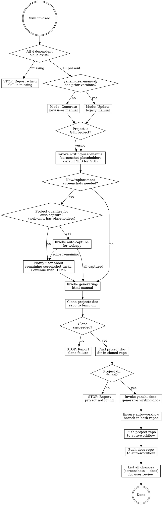

# Manual and Docs Git Sync

After a brainstorming-specify-tdd workflow completes, automatically update the user manual, capture screenshots (for web apps), convert it to HTML, refresh architecture documentation, and push both repos.

## Decision Flow



## Prerequisites

This skill depends on four external plugin skills:

- **yanzhi-user-manual-generator** — provides `writing-user-manual`, `auto-capture-for-webapp`, and `generating-html-manual`
- **yanzhi-docs-generator** — provides `writing-docs`
- **project-version-workflow** — provides `update-commit-bypass`

## Step-by-Step Workflow

Execute each step in order. If any prerequisite check fails, stop immediately and report the missing skill.

### Step 0 — Validate Dependencies

Check that ALL of the following skills exist in the current session:

1. `yanzhi-user-manual-generator:writing-user-manual`
2. `yanzhi-user-manual-generator:generating-html-manual`
3. `yanzhi-docs-generator:writing-docs`
4. `project-version-workflow:update-commit-bypass`

Additionally, check for the optional skill:
5. `yanzhi-user-manual-generator:auto-capture-for-webapp` — may or may not be present; its availability affects Step 4.

**If any of the 4 required skills is missing**, output the missing skill name(s) and stop. If only `auto-capture-for-webapp` is missing, continue — auto-capture will be skipped in Step 4.

---

### USER MANUAL WORKFLOW

### Step 1 — Extract Version Name and Determine Manual Mode

#### 1a — Extract Version Name from Project Source

Extract the project's version name from the source code using the method described in `yanzhi-user-manual-generator:writing-user-manual` Step 1 ("Extract and Validate Version Name"). The writing-user-manual skill searches common locations (config files, source code, spec documents, git tags, changelogs) to find the version name.

**If the version name cannot be found**, stop and warn the user — the version name is required for the manual directory name.

Record the extracted version name as `<version-name>` (e.g., `v123`).

#### 1b — Determine Manual Mode (Generate vs Update)

Check whether the `yanzhi-user-manual/` directory in the project root contains any prior version subdirectories.

**If no prior versions exist** → Generate mode: the writing-user-manual skill will create a new manual from the current project source/spec.

**If prior versions exist** → Update mode: find the latest version directory (by sorting directory names alphabetically or by embedded timestamp), which serves as the legacy manual input. Copy all screenshots from the legacy manual's `screenshots/` directory to preserve them for reference.

The new manual version directory will be named:

```
<version-name>-YYMMDD-HHmmss
```

Where `<version-name>` is from Step 1a (e.g., `v123`), `YYMMDD` is today's date, and `HHmmss` is the current time.

Example: `v123-260601-150233`

### Step 2 — Invoke writing-user-manual

**Before invoking**, determine whether the project is a GUI project. A project is considered GUI if it contains any of the following:

- Web frontend (HTML, React, Vue, Angular, Next.js, etc.)
- Desktop GUI (Electron, Qt, SwiftUI, WinForms, WPF, etc.)
- Mobile app (iOS, Android, Flutter, React Native, etc.)
- CLI/TUI with interactive interfaces
- Any visual interface that end users interact with

**Detection:** Scan the project's source code for UI frameworks, check `package.json` dependencies, or examine the project structure for frontend directories (e.g., `src/`, `app/`, `components/`, `pages/`, `views/`).

**When invoking writing-user-manual**, include the screenshot decision in the invocation context:

- **GUI project** → Invoke with the instruction: "This is a GUI project. Default to using screenshot placeholders — do not ask the user whether to include them. Proceed directly to generating the manual with screenshot placeholders."
- **Non-GUI project** → Invoke normally; the writing-user-manual skill will detect no visual interface and skip the screenshot question automatically.

This ensures the writing-user-manual skill does not interrupt the automated workflow with `AskUserQuestion` prompts about screenshot placeholders.

Invoke `yanzhi-user-manual-generator:writing-user-manual` via the Skill tool.

- **In generate mode**: The skill receives no legacy manual; it will create one from source/spec.
- **In update mode**: Point the skill to the latest legacy manual as input, along with the current project source/spec.

**IMPORTANT:** After the writing-user-manual skill completes, carefully read its terminal output (the screenshot modification table for update mode, or the screenshot placeholder table for generate mode) to determine whether new or replacement screenshots are needed.

Specify the output path as `yanzhi-user-manual/<version-name>-YYMMDD-HHmmss/` (replace with the actual computed version string).

### Step 3 — Check for Screenshot Status

After writing-user-manual completes, check its output:

- If the skill reported **any new screenshot placeholders** (generate mode) or **any "新增" or "替换" entries** in the screenshot modification table (update mode), new screenshots need to be created.
- If only "保留" (keep) entries exist in update mode, no new screenshots are needed.

**If no new screenshots are needed**, skip Step 4 and proceed directly to Step 5 (HTML conversion).

**If new screenshots are needed**, proceed to Step 4 to attempt automatic screenshot capture.

**SAVE for Step 12:** Record the complete screenshot status table (all entries with their statuses: 新增/替换/保留) — this will be presented to the user in the final change review.

### Step 4 — Auto-Capture Screenshots (for Web Apps)

**This step runs ONLY when new/replacement screenshots are needed** (Step 3 detected "yes").

Before notifying the user about manual screenshot work, check whether the project qualifies for automatic screenshot capture via `yanzhi-user-manual-generator:auto-capture-for-webapp`.

#### 4.1 — Check Auto-Capture Eligibility

The project qualifies for auto-capture when ALL of the following conditions are met:

1. **Web-only frontend**: The project's GUI is exclusively a web frontend (React, Vue, Next.js, plain HTML, etc.) — NOT a desktop app, mobile app, CLI, or TUI. Use the same GUI detection from Step 2, but narrow it down: the project must be web-only.

2. **Has `package.json` with a dev server script**: Check for `dev`, `start`, or `serve` scripts in `package.json`. The project must be runnable locally via `npm run dev` (or equivalent).

3. **Manual has screenshot placeholders**: The generated manual contains `【图X：...】` placeholders with corresponding `` image links. (This is guaranteed if Step 3 detected new screenshots.)

4. **Playwright MCP is available**: Check the available MCP tools list for `mcp__plugin_everything-claude-code_playwright__browser_navigate` and related tools.

5. **`auto-capture-for-webapp` skill is available**: The optional skill checked in Step 0 is present.

**If ANY condition is NOT met**, auto-capture is not applicable. Skip to the notification message below and continue to Step 5.

#### 4.2 — Invoke auto-capture-for-webapp

If ALL conditions are met, invoke `yanzhi-user-manual-generator:auto-capture-for-webapp` via the Skill tool.

Pass the following context to the skill:
- **Project source path**: The current project root directory (where the web app source code lives)
- **User manual path**: The newly generated/updated manual at `yanzhi-user-manual/<version-name>-YYMMDD-HHmmss/<manual-filename>.md`

The auto-capture skill will:
- Parse screenshot placeholders from the manual
- Start the project's dev server
- Navigate to each relevant page with Playwright
- Capture screenshots and save them to the manual's `screenshots/` directory

#### 4.3 — Evaluate Auto-Capture Results

After auto-capture completes, review its output:

- **All screenshots captured** (all ✅) → Proceed directly to Step 5 (HTML conversion). No manual notification needed.
- **Some screenshots failed** (mix of ✅ and ⚠️) → Notify the user about remaining items (see notification below), then proceed to Step 5.
- **Auto-capture skill failed or was skipped entirely** → Use the full notification message below, then proceed to Step 5.

**SAVE for Step 12:** Record the per-screenshot auto-capture results (which succeeded ✅ and which failed ⚠️ with reasons). This will be merged into the final change review table.

#### Notification Message (when screenshots remain unfilled)

If any screenshots could not be auto-captured, notify the user:

```
用户手册已生成/更新，部分截图已自动捕获，但仍有以下截图需要手动处理：

✅ 已自动捕获：
[list successfully captured screenshots]

⚠️ 需手动截图：
[list failed/skipped screenshots with their target file paths]

Markdown 和 HTML 均已生成。已有截图已由 generating-html-manual 自动处理，缺失截图在 HTML 中以占位符显示。
请分别向 Markdown 的截图目录和 HTML 输出目录中放入对应的图片文件，刷新 HTML 即可看到完整效果。
```

If auto-capture was entirely skipped (project not eligible), use the original notification from Step 3.

**IMPORTANT:** Regardless of auto-capture results, always continue to Step 5. The HTML and Markdown MUST be generated regardless of missing screenshots.

### Step 5 — Convert to HTML

**Always execute this step**, regardless of whether screenshots were fully captured.

Invoke `yanzhi-user-manual-generator:generating-html-manual` via the Skill tool, pointing to the newly created/updated markdown manual at `yanzhi-user-manual/<version-name>-YYMMDD-HHmmss/<manual-filename>.md`.

The HTML output will be written to `yanzhi-user-manual/<version-name>-YYMMDD-HHmmss/html/` by the generating-html-manual skill.

**Image references:** The `generating-html-manual` skill handles image path conversion and screenshot placement according to its own conventions. This skill does not prescribe the exact directory structure (e.g., subfolder names) — those are defined by `generating-html-manual` and may evolve independently. After HTML generation completes, verify that image references in both Markdown and HTML are consistent with the actual output structure.

---

### ARCHITECTURE DOCS WORKFLOW

### Step 6 — Clone the Documentation Repository

Clone the company documentation repository to a local cache directory. Use a fixed path so the clone can be reused across sync runs:

```bash
TMPDIR="${TMPDIR:-/tmp}"
DOCS_CLONE_DIR="$TMPDIR/projects-doc-clone"

if [ -d "$DOCS_CLONE_DIR/.git" ]; then
  # Clone already exists — fetch latest changes
  cd "$DOCS_CLONE_DIR"
  git fetch origin
  cd "$OLDPWD"
else
  # First time — clone fresh
  git clone http://192.168.1.237:8080/doc/projects-doc "$DOCS_CLONE_DIR"
fi
```

**If the clone or fetch fails**, output the error message and stop. Do not proceed.

### Step 7 — Find the Project Documentation Directory

In the cloned repository (`$DOCS_CLONE_DIR`), locate the subdirectory that corresponds to the **current project**. Match by:

1. The project's directory name (e.g., `basename $(pwd)`)
2. A README or index file listing project names to directory mappings

**If no matching directory is found**, output:
```
在文档仓库中未找到与本项目对应的文档目录。请确认文档仓库中是否已创建本项目的文档目录。
```
Then stop. Do not proceed.

**If found**, note the full path to the project's docs directory. This will be passed as the target to the writing-docs skill.

### Step 8 — Invoke writing-docs

Invoke `yanzhi-docs-generator:writing-docs` via the Skill tool. This skill will detect whether existing docs exist and perform either a full generation or delta update (based on git diff of the last 3 commits).

The writing-docs skill will update the project's doc files in-place within the cloned docs repo.

---

### COMMIT AND PUSH

### Step 9 — Ensure auto-workflow Branch

Both the **project repository** and the **cloned docs repository** must be on (or create) the `auto-workflow` branch before committing and pushing.

For EACH repository:

```bash
# Check if branch exists locally
git branch --list auto-workflow

# If not, check remote and create tracking branch
git fetch origin auto-workflow 2>/dev/null

# Create or switch to auto-workflow
if git show-ref --verify --quiet refs/heads/auto-workflow; then
  git checkout auto-workflow
else
  git checkout -b auto-workflow
fi
```

### Step 10 — Push Both Repositories

**Project repository** (the current working directory):

Invoke `project-version-workflow:update-commit-bypass` via the Skill tool. The skill auto-commits with a conventional commit message, creates a version tag, and pushes to the `auto-workflow` branch.

**Docs repository** (the cloned docs directory at `$DOCS_CLONE_DIR`):

Do NOT use `update-commit-bypass` for the docs repo. Instead, manually commit and push with a commit message that **explicitly identifies which project's documentation was updated**.

First, capture the project name and doc directory path (same name used to match the docs directory in Step 7):

```bash
PROJECT_NAME=$(basename $(pwd))
PROJECT_DOC_DIR="<project-doc-dir>"  # e.g., "智慧教研系统-yz-smart-research"
```

Then execute the following sequence in the docs repo. **This sequence is MANDATORY — do not skip or reorder any step:**

```bash
cd "$DOCS_CLONE_DIR"

# Step 10a — Pull latest changes from remote FIRST
git pull origin auto-workflow

# Step 10b — If git pull reports conflicts, resolve them immediately
# Resolution principle: MAXIMALLY PRESERVE ALL CONTENT from both sides.
# - For each conflicted file, keep ALL unique content from BOTH remote and local versions
# - Do NOT delete or discard any content from either side
# - If the same section was modified differently, keep both versions with clear markers
#   indicating which is remote and which is local
# - After resolving, mark conflicts as resolved:
#   git add <resolved-files>

# Step 10c — Stage all changes in the project's doc directory
git add "$PROJECT_DOC_DIR"/

# Step 10d — Commit with project-identifying message
# The commit message MUST specify which document directory was changed
git commit -m "docs: update $PROJECT_NAME/$PROJECT_DOC_DIR documentation"

# Step 10e — Push to auto-workflow
git push origin auto-workflow
```

The commit message format is: `docs: update <project-name>/<doc-directory> documentation`

This ensures anyone browsing the `projects-doc` commit history can immediately see which project and which doc directory was updated.

**⚠️ CRITICAL: NEVER use `git push --force` (or `git push -f` or `git push --force-with-lease`).**

If `git push` fails (e.g., rejected because remote has newer commits):
1. Run `git pull origin auto-workflow` again to fetch the latest remote changes
2. Resolve any conflicts (maximally preserve all content from both sides)
3. Re-run `git commit` if needed (or amend if conflicts were resolved in the merge commit)
4. Run `git push origin auto-workflow` again
5. Repeat this loop until push succeeds — **never bypass with force push**

**Why not use `update-commit-bypass` for the docs repo?** The `update-commit-bypass` skill auto-generates commit messages from the diff content. Since `projects-doc` is a shared repository containing documentation for multiple projects, a generic auto-generated message like "update architecture docs" would not indicate which project changed. A manual commit with an explicit project identifier is required.

### Step 11 — Keep Temp Directory

**Do NOT delete the cloned `projects-doc` directory.** The clone at `$DOCS_CLONE_DIR` is kept on disk for future reference and reuse. Skipping the deletion avoids re-cloning the entire docs repository in subsequent sync runs.

---

### REVIEW AND FINAL SUMMARY

### Step 12 — List All Changes for User Review

**Before outputting the final summary**, present a comprehensive change review so the user can audit the results. List both screenshot changes (from the user manual workflow) and architecture document changes (from the docs repo commit).

#### 12a — Screenshot Change Review

Collect all screenshot status information from Steps 3 and 4, and present it as a structured table:

```
📸 用户手册截图变更：
| 序号 | 章节 | 截图文件 | 状态 | 备注 |
|------|------|----------|------|------|
| 1 | 登录页面 | login.png | ✅ 已自动捕获 | - |
| 2 | 数据看板 | dashboard.png | ⚠️ 需手动截图 | 自动捕获失败：页面加载超时 |
| 3 | 用户管理 | user-list.png | 📌 保留（未变更） | - |
```

- **Statuses**: `✅ 已自动捕获` (auto-captured), `⚠️ 需手动截图` (failed/skipped, needs manual), `📌 保留（未变更）` (kept from legacy, update mode only), `🆕 新增` (new placeholder, generate mode)
- **If no screenshots at all** (non-GUI project): output `📸 无需截图（非 GUI 项目）`
- **If all screenshots were kept** (update mode, no new): output `📸 所有截图保留自上一版本，无新增或替换`

#### 12b — Architecture Document Change Review

Show the file changes that were committed to the docs repo. Run the following in the docs clone:

```bash
cd "$DOCS_CLONE_DIR"
git show --stat HEAD
```

Present the output as:

```
📄 架构文档变更（projects-doc commit: <commit-hash-short>）：
[git show --stat output showing changed files with +/- line counts]

文档目录：$PROJECT_DOC_DIR/
变更文件：
  - <file1> (+XX -YY lines)
  - <file2> (+XX -YY lines)
  ...
```

**If no files were changed** (e.g., writing-docs detected no updates needed), output:
```
📄 架构文档：无变更（writing-docs 未检测到需要更新的内容）
```

#### 12c — Output Final Summary

After the change review, output the final summary:

```
同步完成：
- 用户手册：yanzhi-user-manual/<version-name>-YYMMDD-HHmmss/ [含 Markdown 和 HTML 版本]
- 截图状态：[无需截图] 或 [全部自动捕获] 或 [部分自动捕获：X/Y 成功，详见上方截图变更表]
- 架构文档：[docs repo path] 已更新（详见上方文档变更）
- 项目仓库：已推送至 auto-workflow 分支
- 文档仓库：已推送至 auto-workflow 分支
- 文档本地副本：$DOCS_CLONE_DIR（已保留，未删除）
```

## Common Mistakes

| Mistake | Correction |
|---------|------------|
| Skipping dependency check | Always validate all 4 required skills exist before starting |
| Forgetting to copy old screenshots in update mode | Copy the legacy `screenshots/` directory to the new version before invoking writing-user-manual |
| Not detecting GUI project before invoking writing-user-manual | Scan project for UI frameworks (web, desktop, mobile, CLI/TUI); if GUI, pass "default screenshot placeholders YES" instruction to avoid AskUserQuestion interruption |
| Skipping auto-capture check when screenshots are needed | Before notifying user about manual screenshots, always check Step 4 eligibility conditions (web-only, has dev server, Playwright available, skill present) |
| Treating auto-capture as all-or-nothing | Auto-capture may partially succeed. Proceed to HTML generation with whatever screenshots were captured; only notify user about the remaining ones |
| Proceeding with HTML when screenshots are missing | Always generate both Markdown and HTML regardless; image reference paths must be correct so user only needs to drop files in |
| Not computing the correct version directory name | Extract version-name from project source using writing-user-manual's method (Step 1a), then combine with YYMMDD-HHmmss timestamp |
| Cloning docs repo into project directory | Always clone to the fixed cache directory (`$TMPDIR/projects-doc-clone`), never inside the project |
| Not matching the project name correctly | Match by project directory basename or explicit mapping in the docs repo |
| Pushing only one repository | Both the project repo AND the docs repo must be pushed |
| Pushing to wrong branch | Both repos must push to `auto-workflow`, NOT `main` |
| Deleting the cloned docs directory | Keep the cloned `projects-doc` directory on disk — do NOT `rm -rf` it. Reusing an existing clone avoids re-cloning the entire docs repo in future sync runs |
| Missing or incorrect image reference paths | After HTML generation, verify both Markdown and HTML image references are consistent with the actual output directory structure; generating-html-manual handles path conversion per its own conventions |
| Using different version names for manual and HTML | Both must use the same `<version-name>-YYMMDD-HHmmss/` directory — HTML output goes inside it as `html/` |
| Using `git push --force` for docs repo | **NEVER** use `--force`, `-f`, or `--force-with-lease`. If push fails, `git pull` → resolve conflicts → re-commit → push again. Repeat until successful. |
| Pushing docs repo without `git pull` first | Always `git pull origin auto-workflow` BEFORE committing and pushing. This prevents unnecessary conflicts and ensures the docs repo is up to date. |
| Discarding content during conflict resolution | When resolving conflicts in `projects-doc`, maximally preserve ALL content from BOTH sides. Never delete or discard content — keep everything from both remote and local versions. |
| Not specifying which doc directory changed in commit message | The commit message must identify the project AND the specific doc directory: `docs: update <project>/<doc-dir> documentation` |
| Skipping user review of changes at end | Always present Step 12 change review (screenshot status table + docs git diff) before final summary. This lets the user audit all changes before the workflow concludes |
